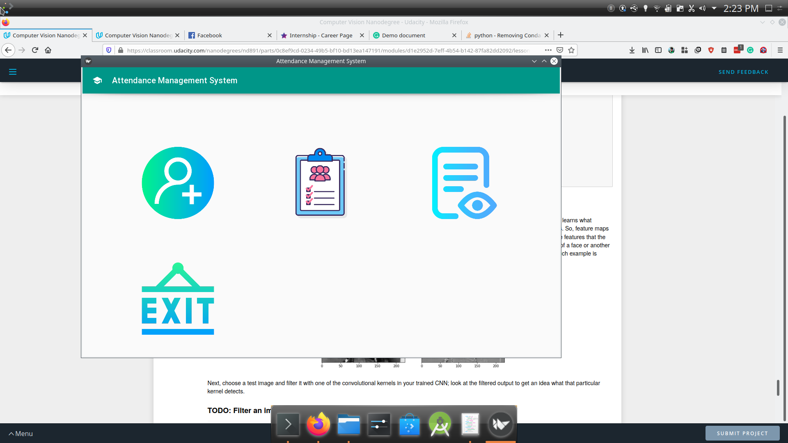
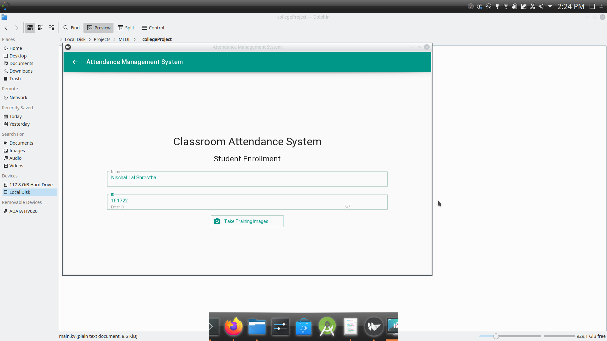
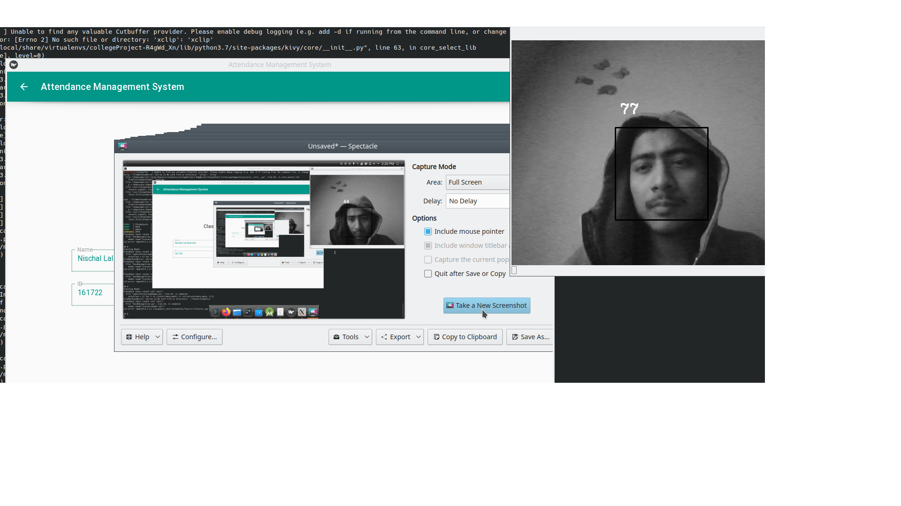

# A Real-time Classroom Attendance System Utilizing Viola–Jones for Face Detection and LBPH for Face Recognition

## Team Members

* [Ashish Tiwari](https://github.com/megamind98/)
* [Saroj Bhattarai](https://github.com/sarojbhattarai)
* [Nischal Lal Shrestha](https://nischal.info.np)

#### To Do: Record students in a database after recognizing them(Database)
- We shall use sqlite database here(more details to follow)

## Abstract
The face of a human is crucial for conveying identity. Computer scientists, Neuro scientists, and psychologists, all exploits this human feature using image processing
techniques for commercial, and law enforcement applications. Likewise, this feature can be invited into classrooms to maintain records of students’ attendance. Con-
temporary traditional way of recording attendance involves human intervention and requires cooperation of the students which is hectic and contribute towards waste of
class time. An automated real-time classroom attendance system detects students from still image or video frame coming from a digital camera, and marks his/her
attendance by recognizing them. The system utilizes Viola–Jones object detection framework which is capable of processing images extremely rapidly with high detec-
tion rates. In the next stage, the detected face in the image is recognized using Local Binary Patterns Histogram.
Keywords–Computer vision; face detection; face recognition; feature extraction; image processing; Local Binary Patterns Histogram; object detection; Viola-Jones object detection.

## Problem Statement
The main problem with the traditional attendance system is that it is subject to manipulation and thre remains chance of human error during data entry.
Though it is easier to implement and saves technology expenses, the organization cannot benefit from the innovations of data analysis which has huge implications.
In addition  to this, contemporary attendance method at classroom requires human intervention and cooperation from students which contribute towards wastage of preecious
class time.

## Getting Started

- Clone the repo using git or download the zip file
- Install all the requirements from the **requirements.txt**.
- Run the Kivy app: **python main.py**

### Problem on Starting??
Remove anything that causes problem. :heart: Please raise an issue if any problem in detecting/recognizing students. Database parts are coming soon.

# Functionalities

## Student Enrollment

**captureTrainingImages.py** is responsible for enrolling students. A student requires **Full Name**, **College ID** and **Sample Images**. After filling name and images, if
we press **Take Training Images** from GUI then a infinite while loop is run until 100 training images are collected. All these iamges are stored in **faces/students** folder and image have a name in this format:  student_full_name + "." + student_ID + "." + str(count) + ".jpg". Then corresponding labels are created. The labels and images are converted to numpy array and they are trained using opencv cv.face.LBPHFaceRecognizer_create(). The trained model is saved as **trainer/model.xml**.

## Student Attendance

**faceRecognition.py** is responsible for recognizing students. The trained model is read and all the detected face coming from the video capture is passed. If confidence
is greater than certain threshold then attendance is done.

## Screenshots

### Home

### Add new Student

### Training

## Built With
* OpenCV
* Kivy

